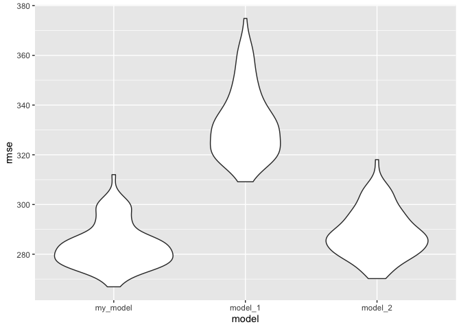
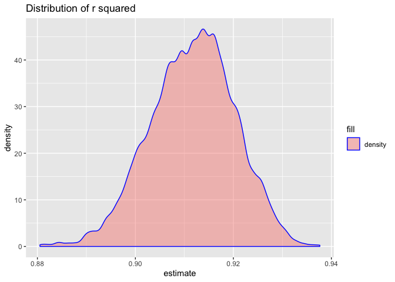

p8105\_hw6\_xc2473
================

**Question
    1**

``` r
library(tidyverse)
```

    ## ── Attaching packages ────────────────────────────────────────────────────────────────────────── tidyverse 1.2.1 ──

    ## ✔ ggplot2 3.2.1     ✔ purrr   0.3.2
    ## ✔ tibble  2.1.3     ✔ dplyr   0.8.3
    ## ✔ tidyr   1.0.0     ✔ stringr 1.4.0
    ## ✔ readr   1.3.1     ✔ forcats 0.4.0

    ## ── Conflicts ───────────────────────────────────────────────────────────────────────────── tidyverse_conflicts() ──
    ## ✖ dplyr::filter() masks stats::filter()
    ## ✖ dplyr::lag()    masks stats::lag()

``` r
library(modelr)
library(mgcv)
```

    ## Loading required package: nlme

    ## 
    ## Attaching package: 'nlme'

    ## The following object is masked from 'package:dplyr':
    ## 
    ##     collapse

    ## This is mgcv 1.8-28. For overview type 'help("mgcv-package")'.

``` r
birthweight = read_csv("./data/birthweight.csv")
```

    ## Parsed with column specification:
    ## cols(
    ##   .default = col_double()
    ## )

    ## See spec(...) for full column specifications.

``` r
sapply(birthweight, function(x) sum(is.na(x)))
```

    ##  babysex    bhead  blength      bwt    delwt  fincome    frace  gaweeks 
    ##        0        0        0        0        0        0        0        0 
    ##  malform menarche  mheight   momage    mrace   parity  pnumlbw  pnumsga 
    ##        0        0        0        0        0        0        0        0 
    ##    ppbmi     ppwt   smoken   wtgain 
    ##        0        0        0        0

``` r
birthweight = birthweight %>% 
  mutate(babysex = as.factor(babysex), 
         frace = as.factor(frace), 
         malform = as.factor(malform), 
         mrace = as.factor(mrace)
         )

my_model = lm(bwt ~ bhead + blength + gaweeks + wtgain, data = birthweight)

bw_resi_predib = 
  merge(
  modelr::add_residuals(birthweight, my_model),
  modelr::add_predictions(birthweight, my_model),
  by = "row.names", all = TRUE)

bw_resi_predib %>% 
ggplot(aes(x = pred, y = resid)) + 
  geom_point(alpha = 0.5, color = "blue") +
  labs(
    title = "Model residuals against fitted values",
    x = "Fitted values",
    y = "Residuals"
  )
```

<!-- -->

Since I think baby’s head circumference at birth, baby’s length at
birth, gestational age in weeks, and mother’s weight gain during
pregnancy are important factors for baby’s birth weight. Therefore, my
model statement is “bwt = bhead \* beta1 + blength \* beta2 + gaweeks \*
beta3 + wtgain \* beta4”.

As we can see from the plot of residuals against fittted values, the
spread is not constant.

``` r
birthweight =
  crossv_mc(birthweight, 100) %>% 
  mutate(
    train = map(train, as_tibble),
    test = map(test, as_tibble))

birthweight = 
  birthweight %>% 
  mutate(my_model  = map(train, ~lm(bwt ~ bhead + blength + gaweeks + wtgain, data = .x)),
         model_1  = map(train, ~lm(bwt ~ blength + gaweeks, data = .x)),
         model_2  = map(train, ~lm(bwt ~ bhead + blength + babysex + bhead * blength + bhead * babysex + blength * babysex, data = .x))
          ) %>% 
  mutate(rmse_my_model = map2_dbl(my_model, test, ~rmse(model = .x, data = .y)),
         rmse_model_1 = map2_dbl(model_1, test, ~rmse(model = .x, data = .y)),
         rmse_model_2 = map2_dbl(model_2, test, ~rmse(model = .x, data = .y)))

birthweight %>% 
  select(starts_with("rmse")) %>% 
  pivot_longer(
    everything(),
    names_to = "model", 
    values_to = "rmse",
    names_prefix = "rmse_") %>% 
  mutate(model = fct_inorder(model)) %>% 
  ggplot(aes(x = model, y = rmse)) + geom_violin()
```

<!-- -->

From the plot we can see that, my model has less prediction error than
other two models. However, the high root mean squared errors suggest
that none of the three models work very well.

**Question 2**

``` r
weather_df = 
  rnoaa::meteo_pull_monitors(
    c("USW00094728"),
    var = c("PRCP", "TMIN", "TMAX"), 
    date_min = "2017-01-01",
    date_max = "2017-12-31") %>%
  mutate(
    name = recode(id, USW00094728 = "CentralPark_NY"),
    tmin = tmin / 10,
    tmax = tmax / 10) %>%
  select(name, id, everything())
```

    ## Registered S3 method overwritten by 'crul':
    ##   method                 from
    ##   as.character.form_file httr

    ## Registered S3 method overwritten by 'hoardr':
    ##   method           from
    ##   print.cache_info httr

    ## file path:          /Users/chenxingyuan/Library/Caches/rnoaa/ghcnd/USW00094728.dly

    ## file last updated:  2019-09-26 10:26:17

    ## file min/max dates: 1869-01-01 / 2019-09-30

``` r
boot_sample = function(df) {
  sample_frac(df, replace = TRUE)
}

boot_straps = 
  tibble(
    strap_number = 1:5000,
    strap_sample = rerun(5000, boot_sample(weather_df))
  )

bootstrap_results = 
  boot_straps %>% 
  mutate(
    models = map(strap_sample, ~lm(tmax ~ tmin, data = .x)),
    tidy = map(models, broom::tidy),
    glance = map(models, broom::glance)) %>% 
  select(-strap_sample, -models) %>% 
  unnest("tidy", keep_empty = TRUE) %>% 
  select(strap_number, term, estimate, glance) %>% 
  pivot_wider(
    names_from = "term",
    values_from = "estimate"
  ) %>% 
  unnest("glance") %>% 
  janitor::clean_names() %>% 
  select(strap_number, r_squared, intercept, tmin) %>% 
  mutate(log_beta = log(intercept * tmin)) 

bootstrap_results %>% 
  ggplot(aes(x = r_squared, fill = "density")) + 
  geom_density(alpha = .4, adjust = .5, color = "blue") +
  labs(title = "Distribution of r squared",
       x = "estimate")
```

<!-- -->

We can see that the distribution of r squared is a little right-skewed,
but it is very close to a normal distribution. The 95% confidence
interval for r squared is 0.894489, 0.9273416.

``` r
bootstrap_results %>% 
  ggplot(aes(x = log_beta, fill = "density")) + 
  geom_density(alpha = .4, adjust = .5, color = "blue") +
  labs(title = "Distribution of log beta0 * beta1",
       x = "estimate")
```

<!-- --> We
can see that the distribution of log(beta0 \* beta1“) is close to a
normal distribution. The 95% confidence interval for estimates of
log(beta0 \* beta1”) is 1.964545, 2.0597169
